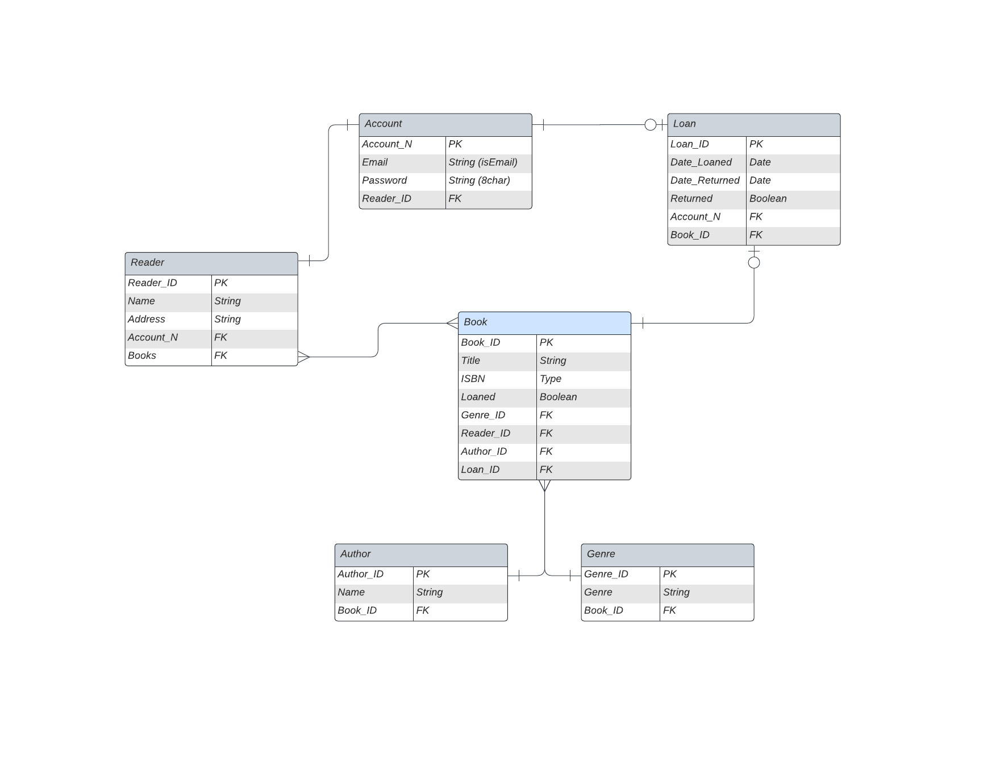

&nbsp;
# &nbsp;&nbsp;&nbsp;&nbsp;&nbsp;&nbsp;&nbsp;&nbsp;&nbsp; Book Exchange App 📚♻️📚
 
&nbsp;&nbsp;&nbsp;&nbsp;&nbsp;&nbsp;&nbsp;&nbsp;&nbsp;&nbsp;&nbsp;&nbsp;&nbsp;&nbsp;&nbsp;&nbsp;&nbsp;&nbsp;&nbsp;&nbsp;**An exercise on Express API creation, Databases and Sequelize.**


### Objectives
***
- To setup an Express API using node-postgres, Sequelize, Mocha/Chai and Supertest for testing.
- Use advanced Sequelize schema validation, error handling and establish complex relationships between database tables.

### Planning the project
---
In order to create this App, I was presented with an imaginary client's requests. I was to create an app that allowed them to do the following:
1. Display their books to be loaned by other users.
2. Loan other users' books.
3. Create an account that would secure their personal information.

I generated an ERD so I could design the database before starting to write any code. This is how I envisioned the project's structure.



I would create the following Models:

<details>
 <summary>Reader ✅ </summary>

| param | data type |
|------|-------------|
| Reader_ID | INT (PK) |
| Name | STRING |
| Book_ID | INT(FK) |

**It will include the Book data of associated models.**
</details>

<details>
 <summary>Book ✅ </summary>

| param | data type |
|------|-------------|
| Book_ID| INT (PK) |
| Title | STRING |
| ISBN | INT |
| Loaned | BOOLEAN |
| Reader_ID | INT (FK)|
| Genre_ID | INT (FK)|
| Author_ID | INT (FK) |
| Loan_ID | INT (FK)|

**It will include the Reader, Genre and Author data of associated models.**

</details>

<details>
 <summary>Author ✅ </summary>
 Author and Genre are individual models to support searches (by Author, Genre or Book) through the library.

| param | data type |
|------|-------------|
| Author_ID | INT (PK) |
| Name | STRING |
| Book_ID | INT (FK)|

</details>

<details>
 <summary>Genre ✅ </summary>
 Author and Genre are individual models to support searches (by Author, Genre or Book) through the library.
 
| param | data type |
|------|-------------|
| Genre_ID | INT (PK) |
| Genre | STRING |
| Book_ID | INT (FK)|

</details>

<details>
 <summary>Account 🚧 </summary>
 **STILL TO BE IMPLEMENTED**: <br/>
 For now, Account data is stored in the Reader Model.

| param | data type |
|------|-------------|
| Account_N | INT (PK) |
| Email | STRING |
| Password | STRING |
|Reader_ID | INT (FK)|

</details>

<details>
 <summary>Loan 🚧 </summary>
 **STILL TO BE IMPLEMENTED**
| param | data type |
|------|-------------|
| Loan_ID | INT (PK) |
| Date_Loaned | DATE |
| Date_Returned | DATE |
| Returned | BOOLEAN |
| Account_N | INT (FK)|
| Book_ID | INT (FK) |

</details>

### Current Version
---

This version supports:

- Creating your own Reader entry that safely stores your personal information.
- Creating & Updating a list of the Books you own.
- Search by Author, Genre or Book.

This version does not include the Loan & Account models nor any functionality or parameter related to them. These will be included in further updates.

### Set Up
---
1. Set up Docker to run a postgres container:
```bash
docker run --name postgres -p 5432:5432 -e POSTGRES_PASSWORD=password -d postgres
```
2. Run pgAdmin 4 and create a new server:
    - hostname/address: localhost
    - user: postgres
    - password: password

3. Fork this project. Then clone the repo to your machine:
```bash 
git clone git@github.com:[your-github-username]/book-library-api
```
4. Install the project's dependencies:
```bash
npm install
```
5. In the root of your project, create a .env file and a .env.test file. Specify in them your environment variables. 
```bash
    PGPASSWORD=password
    PGDATABASE=book_library_dev
    PGUSER=postgres
    PGHOST=localhost
    PGPORT=5433
```
**Make sure your PGPORT matches the one assigned in your pgAdmin4 Server!**

**Make sure your PGDATABASE names are different in your .env & .env.test files!**

6. Run the following code to generate a .gitignore file. 
```bash
npx gitignore your_language #In this case I'm working with Node.js, npx gitignore node.
```
7. Use the following commands to:
```bash
npm test  # Test code.
npm start # Start the app in your preferred port (3000 by default).
```
8. You can interact with the API and test its functions through [Postman](https://www.postman.com/).


### API Endpoints
---
### Reader

<details>
 <summary><code>POST</code> <code><b>/readers</b></code> <code>(creates a new reader entry)</code></summary>

#### Parameters and body content

> | Parameters | Body content |
> |------------|-----------------------------------|
> |  None      | Name [STRING], Email [STRING], Password [STRING](8 characters or more) |


#### Responses

> | code | description |
> |------|-------------|
> | `201` | Successful operation |
> | `400` | Content element empty, null, not unique, not the right format or not the right length  |
 
</details>


<details>
 <summary><code>GET</code> <code><b>/readers</b></code> <code>(returns all the reader entries)</code></summary>

#### Parameters and body content

> | Parameters | Body content |
> |------------|--------------|
> | None | None |


#### Responses

> | code | description |
> |------|-------------|
> | `200` | Successful operation |
> | `404` | Entry not found |
 
</details>


<details>
 <summary><code>GET</code> <code><b>/readers/:id</b></code> <code>(returns a reader entry by ID)</code></summary>

#### Parameters and body content

> | Parameters | Body content |
> |------------|--------------|
> | `Reader_ID` | None |


#### Responses

> | code | description |
> |------|-------------|
> | `200` | Successful operation |
> | `404` | Entry not found |
 
</details>

<details>
 <summary><code>PATCH</code> <code><b>/readers/:id</b></code> <code>(updates a reader entry by ID)</code></summary>

#### Parameters and body content

> | Parameters | Body content |
> |------------|-----------------------------------|
> | `Reader_ID`  | Name [STRING], Email [STRING], Password [STRING](8 characters or more)|


#### Responses

> | code | description |
> |------|-------------|
> | `200` | Successful operation |
> | `404` | Entry not found |
 
</details>

<details>
 <summary><code>DELETE</code> <code><b>/readers/:id</b></code> <code>(deletes a reader entry by ID)</code></summary>

#### Parameters and body content

> | Parameters | Body content |
> |------------|--------------|
> | `Reader_ID`  | None |


#### Responses

> | code | description |
> |------|-------------|
> | `204` | Successful operation |
> | `404` | Entry not found |
 
</details>

### Book
<details>

 <summary><code>POST</code> <code><b>/books</b></code> <code>(creates a new book entry)</code></summary>

#### Parameters and body content

> | Parameters | Body content. Required. | 
> |------------|------------------------|
> | None       | Title [STRING], ISBN [INT], Author_ID [INT], Genre_ID [INT], Reader_ID [INT] |


#### Responses

> | code | description |
> |------|-------------|
> | `201` | Successful operation |
> | `400` | Content element empty, null or not unique  |
 
</details>


<details>
 <summary><code>GET</code> <code><b>/books</b></code> <code>(returns all book entries)</code></summary>

#### Parameters and body content

> | Parameters | Body content |
> |------------|--------------|
> | None | None |


#### Responses

> | code | description |
> |------|-------------|
> | `200` | Successful operation |
> | `404` | Entry not found |
 
</details>

<details>
 <summary><code>GET</code> <code><b>/books/:id</b></code> <code>(returns a book entry by ID)</code></summary>

#### Parameters and body content

> | Parameters | Body content |
> |------------|--------------|
> | `Book_ID` | None |


#### Responses

> | code | description |
> |------|-------------|
> | `200` | Successful operation |
> | `404` | Entry not found |
 
</details>


<details>
 <summary><code>PATCH</code> <code><b>/books/:id</b></code> <code>(updates a book entry by ID)</code></summary>

#### Parameters and body content

> | Parameters | Body content |
> |------------|----------------|
> | `Book_ID`   | Title [STRING], ISBN [STRING], Author_ID [INT], Genre_ID [INT] and/or Reader_ID [INT] |


#### Responses

> | code | description |
> |------|-------------|
> | `200` | Successful operation |
> | `404` | Entry not found |
 
</details>

<details>
 <summary><code>DELETE</code> <code><b>/books/:id</b></code> <code>(deletes a book entry by ID)</code></summary>

#### Parameters and body content

> | Parameters | Body content |
> |------------|--------------|
> | `Book_ID` | None |


#### Responses

> | code | description |
> |------|-------------|
> | `204` | Successful operation |
> | `404` | Entry not found |
 
</details>

### Author

<details>
 <summary><code>POST</code> <code><b>/authors</b></code> <code>(creates a new author entry)</code></summary>

#### Parameters and body content

> | Parameters | Body content |
> |------------|----------------|
> | None       | Name [STRING] |


#### Responses

> | code | description |
> |------|-------------|
> | `201` | Successful operation |
> | `400` | Content element empty, null or not unique  |
 
</details>


<details>
 <summary><code>GET</code> <code><b>/authors</b></code> <code>(returns all the author entries)</code></summary>

#### Parameters and body content

> | Parameters | Body content |
> |------------|--------------|
> | None | None |


#### Responses

> | code | description |
> |------|-------------|
> | `200` | Successful operation |
> | `404` | Entry not found |
 
</details>


<details>
 <summary><code>GET</code> <code><b>/authors/:id</b></code> <code>(returns an author entry by ID)</code></summary>

#### Parameters and body content

> | Parameters | Body content |
> |------------|--------------|
> | `Author_ID` | None |


#### Responses

> | code | description |
> |------|-------------|
> | `200` | Successful operation |
> | `404` | Entry not found |
 
</details>

<details>
 <summary><code>PATCH</code> <code><b>/authors/:id</b></code> <code>(updates an author entry by ID)</code></summary>

#### Parameters and body content

> | Parameters | Body content |
> |------------|-----------------------------------|
> | `Author_ID`   | Name [STRING] |


#### Responses

> | code | description |
> |------|-------------|
> | `200` | Successful operation |
> | `404` | Entry not found |
 
</details>

<details>
 <summary><code>DELETE</code> <code><b>/authors/:id</b></code> <code>(deletes an author entry by ID)</code></summary>

#### Parameters and body content

> | Parameters | Body content |
> |------------|--------------|
> | `Author_ID` | None |


#### Responses

> | code | description |
> |------|-------------|
> | `204` | Successful operation |
> | `404` | Entry not found |
 
</details>

### Genre

<details>
 <summary><code>POST</code> <code><b>/genres</b></code> <code>(creates a new genre entry)</code></summary>

#### Parameters and body content

> | Parameters | Body content |
> |------------|----------------|
> | None       | Genre[STRING] |


#### Responses

> | code | description |
> |------|-------------|
> | `201` | Successful operation |
> | `400` | Content element empty, null or not unique  |
 
</details>

<details>
 <summary><code>GET</code> <code><b>/genres</b></code> <code>(returns all the genre entries)</code></summary>

#### Parameters and body content

> | Parameters | Body content |
> |------------|--------------|
> | None | None |


#### Responses

> | code | description |
> |------|-------------|
> | `200` | Successful operation |
> | `404` | Genres not found |
 
</details>


<details>
 <summary><code>GET</code> <code><b>/genres/:id</b></code> <code>(returns a genre entry by ID)</code></summary>

#### Parameters and body content

> | Parameters | Body content |
> |------------|--------------|
> | `Genre_ID` | None |


#### Responses

> | code | description |
> |------|-------------|
> | `200` | Successful operation |
> | `404` | Entry not found |
 
</details>

<details>
 <summary><code>PATCH</code> <code><b>/genres/:id</b></code> <code>(updates a genre entry by ID)</code></summary>

#### Parameters and body content

> | Parameters | Body content |
> |------------|-----------------------------------|
> | `Genre_ID`   | Genre [STRING] |


#### Responses

> | code | description |
> |------|-------------|
> | `200` | Successful operation |
> | `404` | Entry not found |
 
</details>

<details>
 <summary><code>DELETE</code> <code><b>/genres/{id}</b></code> <code>(deletes a genre entry by ID)</code></summary>

#### Parameters and body content

> | Parameters | Body content |
> |------------|--------------|
> | `Genre_ID` | None |


#### Responses

> | code | description |
> |------|-------------|
> | `204` | Successful operation |
> | `404` | Entry not found |
 
</details>

### Tests
---
I have been using Mocha, Chai and Supertest to write test suites trying the functionality of the API. This is the result for the current version when running ``` npm test```:

<details><summary>Test Results</summary>
```bash
/authors
    with no records in the database
      POST /authors
        ✔ creates a new author in the database (770ms)
        ✔ errors if name is null
    with records in the database
      GET /authors
        ✔ gets all authors records
      GET /authors/:id
        ✔ gets authors record by id
        ✔ returns a 404 if the author does not exist
      PATCH /authors/:id
        ✔ updates authors name by id
        ✔ returns a 404 if the author does not exist
      DELETE /authors/:id
        ✔ deletes author record by id
        ✔ returns a 404 if the author does not exist

  /books
    with no records in the database
      POST /books
        ✔ creates a new book in the database
        ✔ errors if title is null
    with records in the database
      GET /books
        ✔ gets all books records
      GET /books/:id
        ✔ gets books record by id
        ✔ returns a 404 if the book does not exist
      PATCH /books/:id
        ✔ updates books title by id
        ✔ returns a 404 if the book does not exist
      DELETE /books/:id
        ✔ deletes book record by id
        ✔ returns a 404 if the book does not exist

  /genres
    with no records in the database
      POST /genres
        ✔ creates a new genre in the database
        ✔ errors if genre is null
    with records in the database
      GET /genres
        ✔ gets all genres records
      GET /genres/:id
        ✔ gets genres record by id
        ✔ returns a 404 if the genre does not exist
      PATCH /genres/:id
        ✔ updates genres genre by id
        ✔ returns a 404 if the genre does not exist
      DELETE /genres/:id
        ✔ deletes genre record by id
        ✔ returns a 404 if the author does not exist

  /readers
    with no records in the database
      POST /readers
        ✔ creates a new reader in the database
        ✔ errors if email format not valid
        ✔ errors if any fields are missing
        ✔ errors password is less than 8 char length
    with records in the database
      GET /readers
        ✔ gets all readers records
      GET /readers/:id
        ✔ gets readers record by id
        ✔ returns a 404 if the reader does not exist
      PATCH /readers/:id
        ✔ updates readers email by id
        ✔ returns a 404 if the reader does not exist
      DELETE /readers/:id
        ✔ deletes reader record by id
        ✔ returns a 404 if the reader does not exist


  38 passing (3s)
```
</details>
